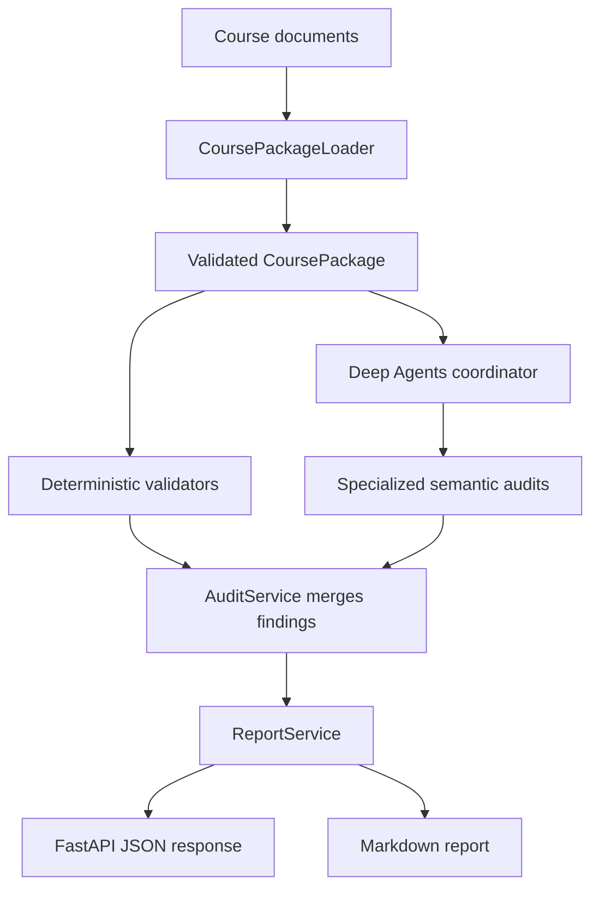

# Course Readiness Auditor

A backend prototype that audits university course materials before they are published to students. It combines deterministic Python validation with specialized LLM agents to find contradictions, missing information, and unclear expectations across a syllabus, course schedule, assignment brief, and grading rubric.

The result is a structured, evidence-backed `AuditReport` that can be returned as JSON through FastAPI or rendered as Markdown.

## The problem

Course information is often spread across several documents that are written or updated independently. A syllabus may list one deadline while the schedule lists another. A rubric may grade work that the assignment never requests. Important policies may also be technically present but too vague for a student to act on.

These problems are easy to miss in a manual review because some require exact comparison while others require an understanding of meaning and context.

The Course Readiness Auditor treats this as a document-audit workflow rather than a generic chatbot. Every finding has:

- a severity and category;
- evidence tied to specific source files;
- an explanation of the student impact;
- a recommended correction;
- the validator or agent that detected it.

The prototype audits a prepared fictional course package:

| Planted issue | Detection method |
|---|---|
| Assessment weights total 105% | Deterministic validator |
| Assignment 2 has different due dates in the syllabus and schedule | Deterministic validator |
| Assignment 2 is due before database normalization is taught | Deterministic validator |
| The rubric grades automated test coverage, but the brief does not require tests | Assessment Alignment Auditor |
| The syllabus and assignment brief define contradictory late policies | Schedule & Policy Auditor |
| The accessibility instructions do not identify a usable process or contact | Schedule & Policy Auditor |

## Architecture



### Main components

| Component | Responsibility |
|---|---|
| `CoursePackageLoader` | Reads the prepared JSON and Markdown files, parses known fields, and normalizes them into a `CoursePackage`. It does not perform auditing. |
| Pydantic domain models | Define and validate course records, topics, documents, evidence, findings, agent results, and the final report. |
| Deterministic validators | Perform exact, repeatable checks for grade totals, conflicting due dates, and assignment-topic sequencing. |
| Course Readiness Coordinator | Runs the semantic portion of the audit and delegates work to the appropriate specialist. It does not create its own findings. |
| Assessment Alignment Auditor | Compares assignment requirements, grading criteria, and relevant syllabus expectations. |
| Schedule & Policy Auditor | Reviews course-wide policies and schedule expectations for contradictions, ambiguity, and missing guidance. |
| `AuditService` | Loads the package, runs both audit paths, combines their findings, and derives the overall status. |
| `ReportService` | Deduplicates findings, merges supporting evidence, preserves the higher severity, sorts the result, and optionally renders Markdown. |
| FastAPI route | Exposes the prepared audit through `POST /audits/run`. |

### Audit flow

1. `CoursePackageLoader` parses the sample files into a validated `CoursePackage`.
2. `AuditService` runs all registered deterministic validators.
3. The service builds a semantic-audit request containing the source documents and invokes the coordinator.
4. The coordinator delegates one alignment review for each relevant assessment and one course-wide policy review.
5. Each subagent returns findings using the `AgentAuditResult` schema.
6. `AuditService` validates the structured response, combines both sets of findings, and calculates the status.
7. `ReportService` deduplicates and severity-sorts the findings before they are returned.

The status is derived from the most serious finding:

| Findings | Audit status |
|---|---|
| At least one critical finding | `not_ready` |
| No critical findings, but at least one warning | `needs_review` |
| No critical or warning findings | `ready` |

## Why Deep Agents?

The semantic audit naturally divides into separate areas of responsibility. Assessment alignment and course policy require different instructions, evidence, and judgment. Giving each area to a focused subagent keeps the roles clear and prevents one large prompt from mixing unrelated concerns.

The coordinator provides the orchestration layer:

- it decides which specialist receives each task;
- it creates one assessment-alignment task per relevant assessment;
- it creates one course-wide schedule-and-policy task;
- it preserves filenames and passes the documents as source material;
- it combines the specialists' structured findings without rewriting them.

Only two subagents are used because they correspond to meaningful domain boundaries. Adding more agents would increase model calls, latency, and coordination complexity without improving this prototype.

For a fixed four-document example, two direct model calls could be simpler. Deep Agents becomes more valuable as the number of assessments and review specialties grows. This project intentionally uses the prototype to explore that delegation model while keeping the rest of the system small.

## Deterministic validation versus agent reasoning

The central engineering decision is to avoid using an LLM for checks that ordinary code can perform more reliably.

| Deterministic Python | Specialized agents |
|---|---|
| Adds assessment weights | Interprets whether a rubric matches an assignment |
| Compares exact dates for the same assessment | Finds contradictions expressed in different language |
| Compares due dates with topic teaching dates | Judges whether instructions are vague or incomplete |
| Produces identical results for identical structured input | Explains likely student impact |
| Is inexpensive and straightforward to unit test | Recommends context-sensitive corrections |

This separation improves reliability and makes failures easier to diagnose. Python handles facts that have a single correct answer; agents handle questions whose answer depends on meaning across documents.

Pydantic models reinforce the boundary. Both application-generated and agent-generated findings must conform to the same `AuditFinding` schema before they enter the final report. Structured output makes the response predictable, but it does not make the agent's reasoning automatically correct, so every semantic finding is still required to include source-specific evidence.

## API

### Run the sample audit

```http
POST /audits/run
```

The current endpoint takes no request body and audits the fixed package in `app/sample_course`.

```bash
curl -X POST http://127.0.0.1:8000/audits/run
```

The response follows this shape:

```json
{
  "course_name": "COMP 4000 — Software Systems Engineering",
  "audit_status": "not_ready",
  "findings": [
    {
      "severity": "critical",
      "category": "grading",
      "evidence": [
        {
          "source_file": "syllabus.md",
          "details": "Published weights total 105%."
        }
      ],
      "summary": "Assessment weights total 105%",
      "explanation": "The published assessment weights do not total 100%, so the final-grade calculation is incorrect.",
      "recommendation": "Adjust the assessment weights so the published total is 100%.",
      "detected_by": "validate_grade_total"
    }
  ],
  "generated_at": "2026-07-28T00:00:00+00:00"
}
```

The exact semantic findings can vary between model runs; the deterministic findings do not.

## Getting started

### Requirements

- Python
- a Gemini API key
- the dependencies declared in `requirements.txt`

### Install and run

```bash
python -m venv .venv
```

Activate the environment:

```bash
# macOS/Linux
source .venv/bin/activate

# Windows PowerShell
.venv\Scripts\Activate.ps1
```

Install the project dependencies:

```bash
pip install -r requirements.txt
```

Set `GOOGLE_API_KEY` in your environment, then start the API:

```bash
uvicorn app.main:app --reload
```

Open `http://127.0.0.1:8000/docs` to run the audit through FastAPI's interactive Swagger UI.

The current route uses `google_genai:gemini-3.5-flash-lite`. It includes client-side pacing, retries, and a request timeout. These reduce bursts but cannot increase the provider's account-level quota, so a quota-exhausted response may still require waiting for the quota window to reset or using an appropriately provisioned API account.

## Testing

Run the deterministic test suite with:

```bash
pytest
```

The current tests cover:

- invalid and valid grade totals;
- conflicting and matching due dates;
- assignments due before and after required topics;
- severity sorting;
- normalized-summary deduplication;
- evidence and detector merging;
- category-aware duplicate handling;
- preservation of the original report object.

There are no live-model assertions in the unit suite. LLM output is variable, slow, and quota-dependent, so the tests focus on deterministic domain and report logic. Agent quality should instead be evaluated against a versioned set of representative course packages and expected findings.

## Project structure

```text
app/
├── agents/
│   ├── assessment_alignment_auditor.py
│   ├── coordinator.py
│   └── schedule_policy_auditor.py
├── api/
│   └── audits.py
├── domain/
│   ├── models.py
│   └── validators.py
├── services/
│   ├── audit_service.py
│   └── report_service.py
├── tests/
│   ├── test_report_service.py
│   └── test_validators.py
├── course_package_loader.py
├── main.py
└── sample_course/
    ├── assignment_brief.md
    ├── course_schedule.json
    ├── grading_rubric.md
    └── syllabus.md

```

## Trade-offs and limitations

### Full documents are repeated for each delegated task

Passing every document to every subagent keeps each review self-contained and makes it less likely that relevant evidence will be omitted. It also duplicates tokens and increases cost and latency. A larger system should select only the documents and sections relevant to each task.

### Semantic results are non-deterministic

Prompts, structured schemas, and evidence requirements constrain the agents, but they cannot guarantee that every issue will be found or that every finding will be correct. The report is decision support for an instructor or reviewer, not an autonomous approval decision.

### The API runs the complete audit synchronously

This keeps the prototype easy to understand and demonstrate, but one HTTP request remains open while the coordinator and subagents make several model calls. Provider rate limits can therefore make the endpoint slow or cause it to fail after retries.

### Deduplication is intentionally simple

`ReportService` considers findings duplicates when their categories match and their normalized summaries match. This is predictable and testable, but differently worded reports of the same issue may remain separate, while two distinct findings with the same generic summary could be merged.

### Parsing assumes a known document format

The loader is appropriate for the prepared sample because its structure is predictable. It is not yet a general ingestion system for arbitrary instructor documents, scanned PDFs, or inconsistent spreadsheet formats.

### The prototype is deliberately narrow

It audits one local sample package and has no authentication, uploads, database, queue, frontend, or LMS integration. Those features were excluded so the prototype could focus on orchestration, domain boundaries, structured output, and testable audit logic.

## Production extensions

A production version would extend the prototype in several stages:

1. **Flexible course documents**
   - accept uploaded course packages and additional file types;
   - validate file size, type, and required contents;
   - extract structured records from less predictable documents;
   - add deterministic checks for duplicate IDs, missing fields, and other exact cross-document conflicts.

2. **Asynchronous audit runs**
   - place audits on a background queue;
   - persist audit runs, statuses, findings, and failures in a database;
   - expose endpoints for starting an audit and polling its progress;
   - support retries and cancellation without holding an HTTP request open.

3. **Smarter context management**
   - select documents and sections based on the assigned specialist and assessment;
   - avoid resending unrelated content;
   - introduce retrieval only when document volume makes full-context review impractical.

4. **Reliability and evaluation**
   - build a versioned evaluation dataset with expected findings;
   - measure false positives, missed issues, latency, and cost;
   - version prompts and models;
   - add provider-aware backoff, quota monitoring, caching, and fallback policies;
   - trace coordinator and subagent calls with request and audit IDs.

5. **Security and governance**
   - add authentication, authorization, and tenant isolation;
   - treat uploaded content as untrusted and strengthen prompt-injection defenses;
   - define retention and privacy controls for course material;
   - require human approval before changing or publishing any document.

6. **Institutional integration**
   - connect to an LMS or document repository;
   - notify instructors when an audit completes;
   - generate suggested edits while preserving the original source;
   - support comparisons between document versions before a course is published.

## Scope

The auditor is meant to catch readiness problems and explain them clearly. It does not decide academic policy, guarantee compliance, or automatically edit course materials. Final publication decisions should remain with the instructor or institution.
